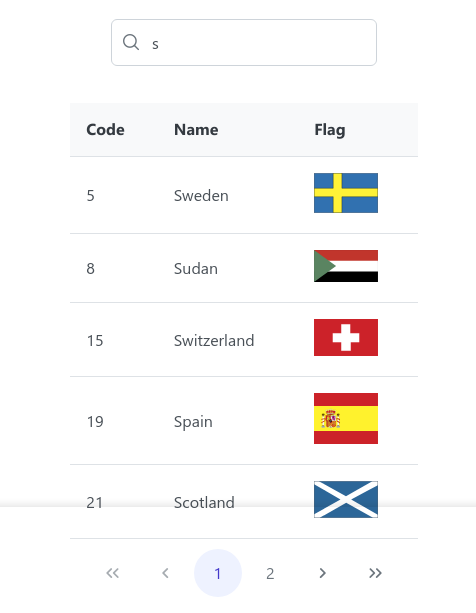

<h1 align="center"> Vue - Countries </h1>

  <a href="#tecnologies">Tecnologias</a>&nbsp;&nbsp;&nbsp;|&nbsp;&nbsp;&nbsp;
  <a href="#project">Projeto</a>&nbsp;&nbsp;&nbsp;|&nbsp;&nbsp;&nbsp;
    <a href="#orientations">Orientações</a>&nbsp;&nbsp;&nbsp;|&nbsp;&nbsp;&nbsp;
  <a href="#challenges">Desafios</a>&nbsp;&nbsp;&nbsp;|&nbsp;&nbsp;&nbsp;
  <a href="#extres">Extras</a>&nbsp;&nbsp;&nbsp;|&nbsp;&nbsp;&nbsp;
  <a href="#license">Licença</a>

  

 

  

## 🚀 Tecnologias

 Esse projeto foi desenvolvido com as seguintes tecnologias: 

- Vue 3.
- PrimeVue (biblioteca de componentes)

## 💻 Projeto

 "Vue Countries" é um projeto desenvolvido que utilizei para treinar meus conhecimentos com a Composition API e com a ferramenta chamada "PrimeVue" que oferece muitos recursos (componentes) de estilização. 

  <ul style="margin-left: 20px;">
      <li>Paginação; </li>
      <li> Busca. </li>
  </ul>

## 🗺️ Orientações

<ul style="margin-left: 20px" id="orientations">
  <li> Execute em seu terminal o comando npm i para instalar as dependências. </li>
  <li> Execute em seu terminal o comando npm run dev para rodar o projeto. </li>
</ul>

## ⚔️ Desafios enfrentados

 
  Não foi difícil realizar o projeto com a Compostion API, porém tive um pouco mais de difculdades em relação ao PrimeVue, mas nada que me desse total dor de cabeça rs... é uma biblioteca fácil de utilizar e que oferece muitos recursos interessantes.

## 🧑‍🔧 Extras

 
  Fique a vontade para realizar qualquer mudança.

## :memo: Licença

 Esse projeto está sob a licença MIT. 
